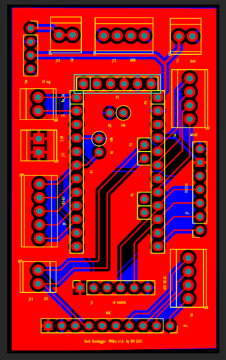

# Arduino Pro Mini PCB Design

This folder contains a PCB file for a basic arduino data logger in [kicad](https://www.kicad.org/) format. 

File is available [here](Promini1.kicad_pcb). 

## Bill of Materials
Bill of materials for completed board:
(to be updated)

## Pricing and Ordering
The PCB can be easily ordered through suppliers such as [OSHPark](oshpark.com).

Pricing is approximtely $20 for 3 boards (pricing retrieved 22nd May 2023).

**Created by Dr Bruce Main - Department of Geography, King's College London, United Kingdom**
